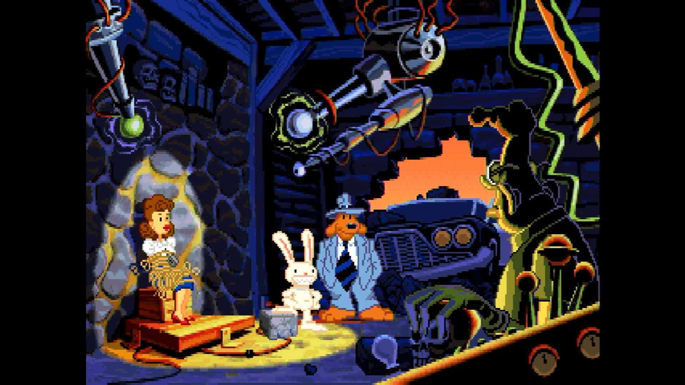

# pi-scummvm

**ScummVM running directly on a Raspberry Pi with no operating system.** The
board powers on and the adventure game is what boots: no Linux, no desktop, no
launcher, and nothing else running beside it.

It builds for the Raspberry Pi 3, Pi 4 and Pi 5, all three from one source
tree.



*Captured from the Pi 5's HDMI output.*

## What this is

[ScummVM](https://www.scummvm.org/) plays the classic point-and-click
adventure games by re-implementing the engines they were written for. This
repository is the thin layer that lets it run with nothing underneath: a
[Circle](https://github.com/rsta2/circle) kernel that brings the board up, and
[circle-libsdl2](https://github.com/Xalior/circle-libsdl2), an SDL2
implementation built on Circle's bare-metal drivers.

ScummVM's own source is not copied or modified here. It is a submodule, pinned
at an upstream release, and the build reads it without ever writing to it.
Where ScummVM needs something the SDL2 layer does not provide, this repository
supplies it in `host/` rather than changing ScummVM.

Three processor cores are given separate work:

- **Core 0** owns the hardware. Circle's world lives here — interrupts, USB,
  the SD card, sound — and no other core touches a device.
- **Core 1** runs ScummVM and nothing else.
- **Core 2** puts finished frames on the screen.

## One engine: SCUMM

**This build plays the LucasArts adventures.** ScummVM supports well over a
hundred engines, and building all of them produces hundreds of megabytes of
object files and a kernel image far larger than a Raspberry Pi boots
comfortably. This repository enables the SCUMM engine — the one written for
LucasArts' own games:

- The Secret of Monkey Island, Monkey Island 2, The Curse of Monkey Island
- Day of the Tentacle, Maniac Mansion
- Sam & Max Hit the Road
- Indiana Jones and the Last Crusade, Indiana Jones and the Fate of Atlantis
- Loom, Zak McKracken, The Dig, Full Throttle

SCUMM has two sub-engines of its own, and they are separate switches because
they are separate bodies of code inside the same engine:

- **Version 7 and 8** (Full Throttle, The Dig, The Curse of Monkey Island) is
  **on**. It brings the digital iMUSE sound engine and the SMUSH video player
  with it, both of which are ScummVM's own code and need nothing from outside.
- **Humongous Entertainment** (Putt-Putt, Freddi Fish, Backyard Sports) is
  **off**. It is a different family of games, and it depends on two things
  this port does not have: high-resolution 16-bit colour, and the Bink video
  decoder.

Adding another engine is three small edits and no new code — the enabling
line in `host/Makefile`, the engine's directory in the module list beside it,
and one entry in each of the two tables in `host/svmgen/engines/`. Every
engine costs build time and image size, so they are added deliberately rather
than by default.

### What SCUMM needed that a smaller engine did not

Worth recording, because it is the kind of thing that only shows up when you
try. SCUMM does not link at all without ScummVM's **FM Towns and PC-98 sound
chip emulation**: the engine's Towns music driver calls straight into it, with
no switch to turn that off. ScummVM's own `configure` knows this and switches
the component on for any build containing SCUMM, and this build does the same.
The Commodore 64 sound chip emulation, for the C64 releases of Maniac Mansion
and Zak McKracken, is switched on for the same reason.

Both are ScummVM's own C++ and depend on nothing outside the tree, so neither
costs this port anything but build time. SCUMM declares a third component,
its in-game debugger interface, which needs the Dear ImGui library and a
renderer written against it; that one is left out.

## State of this port

This is an early port. **It builds and links completely, for all three
boards, and it has not been run on hardware.** The list below is what the code
does, not what has been observed. Nothing here has drawn a frame on a screen
yet.

**Present:**

- Video: ScummVM's software rendering path end to end. The older games draw a
  320x200 paletted picture, ScummVM scales it to 640x480, and the display
  shows that. The version 7 and 8 games draw 640x480 themselves.
- Mouse: circle-libsdl2 implements the whole SDL mouse interface over
  Circle's USB driver. **This has never been exercised on hardware.** It
  matters more here than in any other game on this family of boards, because
  a SCUMM game is played entirely with a pointer.
- Keyboard: USB keyboards through Circle's HID driver.
- Sound: ScummVM's own mixer, feeding circle-libsdl2's audio output. Music
  goes through ScummVM's built-in synthesisers — Adlib, FM Towns, PC-98, SID
  — none of which needs an external library.
- Files: the game data, the configuration file and the saved games, read from
  and written to the SD card.

**Absent, and why:**

- **Compressed files of any kind.** This build has no zlib, because there is
  no library to link against. Everything ScummVM reads must already be
  unpacked — including the interface theme, which upstream also ships as a
  `.zip`. See "Putting it on a card" below.
- **Compressed audio.** Some ScummVM releases of these games replace the
  original sound files with Ogg Vorbis, MP3 or FLAC versions to save space.
  None of those decoders is in this build, for the same reason as zlib. Use
  the game's original files.
- **Timers run when ScummVM looks at them.** SDL serves its callback timers
  from a thread, and there are no threads here. This port fires them at the
  two moments ScummVM is certain to reach — every event poll and every delay
  — so a timer callback runs late whenever ScummVM is inside one long
  uninterrupted operation, such as loading a room. Nothing is dropped, only
  deferred. What that can look like is music timing stumbling at a scene
  change.
- **No clipboard, no browser, no touch screen, no screen saver.** There is no
  desktop for any of them to belong to, and each call says so rather than
  pretending.

## What you need to supply

**This repository ships no game data.** A SCUMM game's rooms, artwork,
scripts, speech and music are the publisher's, not ScummVM's and not this
project's. Building the images does not download anything, and neither does
staging a card — `make media` is a separate, explicit step, and the one
game it can fetch (see below) is a freely distributable demo, not a
retail release.

ScummVM's own [game
documentation](https://wiki.scummvm.org/index.php/Category:Supported_Games)
lists what each game's files are called. As a rule you need every file the
game shipped with, most often a small handful:

| Typical files | Example |
|---|---|
| `*.000` and `*.001` | `MONKEY.000`, `MONKEY.001` — Monkey Island 2 and later |
| `*.LFL` | `00.LFL`, `01.LFL` … — Maniac Mansion, Zak McKracken, Indiana Jones |
| `*.LA0` / `*.LA1`, `*.SM0` / `*.SM1` | Day of the Tentacle, Sam & Max |
| `*.LA0` plus `*.SAN` | Full Throttle, The Dig — the `.SAN` files are the videos |

### Where they legitimately come from

**A copy you own.** The Steam, GOG and disc releases all install the game's
files as ordinary files. Copying those files is all that is needed.

**One game has a legitimately free demo, and `make media` fetches it.**
LucasArts gave away a demo of Day of the Tentacle on magazine cover discs in
1997, and it is still freely available: the SCUMM engine's own index and
resource files, its speech and sound resource, and its music driver data —
the same shape the full game uses, just the one demo scenario. Checked
against ScummVM's own published freeware list first: none of the eleven
games it names use the SCUMM engine, so this demo is the only legitimately
free SCUMM data this build can fetch for you.

```sh
make media      # fetches the Day of the Tentacle demo into media/game/
```

It downloads one zip, verifies it against the checksum computed the first
time this project fetched it (no independently published checksum exists for
this file), unpacks it, and writes `media/provenance.txt` recording where it
came from and under what terms.

Every other SCUMM game, including the full Day of the Tentacle, is a
commercial product with no free equivalent. There is no address this project
could honestly download one from — copy your own into `media/game/`,
replacing the demo's files, and stage the card again.

### Where to put them

```sh
mkdir -p media/game
cp /path/to/your/game/* media/game/
make card
```

`media/` is where a game's files live **on the machine building the card**. It
is not tracked by git and it is never part of anything this repository
publishes. `make card` copies it onto the staged card and downloads nothing,
ever. A card staged with `media/` empty is complete except for the game, says
which part is missing, and is a perfectly good build — it is what a
continuous-integration runner produces.

Two practical points:

- **Unpack everything first.** Game downloads usually arrive as a `.zip`, and
  nothing on the board can open one.
- **Keep filenames 8.3-safe and do not rely on capitalisation.** The card is
  FAT, where `MONKEY.000` and `monkey.000` are the same file.

## Building

You need a Linux or macOS machine, GNU make, and the Arm GNU toolchain for
`aarch64-none-elf` (release 15.2.Rel1). Put its `bin` directory on your
`PATH`, or unpack it into `toolchains/` in this repository.

```sh
git clone --recursive https://github.com/Xalior/pi-scummvm.git
cd pi-scummvm
make deps       # long: builds newlib and libc++ from source, once per board
make kernels    # the three board images
make verify     # confirms each image exists and is not empty
```

`make deps` is the slow step, and it is slow once. It builds a complete C and
C++ world for each board, because each board's world is compiled for its own
processor.

Part of that world is libc++, whose sources are fetched from a git tag that
carries the bare-metal patches. That tag is hosted on Codeberg, which is small
and volunteer run. One copy is enough for every board and for every project on
your machine, so tell the build where to keep it and it is fetched once:

```sh
make deps CIRCLE_LLVM=/path/to/circle-llvm
```

The default puts that checkout beside this repository, which is the right
answer for a plain clone or a continuous-integration runner and needs no
setting at all.

`make kernels` compiles about five hundred ScummVM source files per board and
takes a while even on a fast machine. The images land in `host/build/<board>/`:

| Board | Image |
|---|---|
| Pi 3 | `host/build/rpi3/kernel8.img` |
| Pi 4 | `host/build/rpi4/kernel8-rpi4.img` |
| Pi 5 | `host/build/rpi5/kernel_2712.img` |

Building one board on its own is `make rpi5`, and its dependencies alone are
`make deps-rpi5`, which is what a machine without room for three worlds wants.

`make -C host sources` prints every ScummVM file this build compiles, which is
the answer to "is that file in the image" when memory is not good enough.

## Putting it on a card

```sh
make card
```

That stages the card into `build/sd-card/` for you to copy onto FAT32 media:
the three kernel images under the names each board's firmware looks for, the
boot configuration, and ScummVM's own support files in `games/scummvm/`.

That includes the game's files, if `media/game/` has any in it. Nothing is
downloaded at any point.

One thing is never staged and has to be added by hand: **the Raspberry Pi
firmware files** — `bootcode.bin`, `start*.elf`, `fixup*.dat` and, for the
Pi 4, `armstub8-rpi4.bin`. Take them from a Raspberry Pi OS card or from the
[firmware repository](https://github.com/raspberrypi/firmware).

The finished card looks like this:

```
kernel8.img  kernel8-rpi4.img  kernel_2712.img   the three boards' images
config.txt  cmdline.txt                          boot configuration
games/scummvm/themes/scummclassic/               the interface theme, unpacked
games/scummvm/game/                              one game, copied from media/
games/scummvm/scummvm.ini                        written on first run
games/scummvm/saves/                             written when you save
```

**`game/` holds one game, and the board works out which one it is.** The
kernel starts ScummVM pointed at that directory and asks it to identify what
is in there, so there is nothing to configure: put Day of the Tentacle's files
in `media/game/` and Day of the Tentacle boots. To play a different game,
change what is in the directory and stage the card again.

**Everything ScummVM touches is under `games/scummvm/`, and nothing is written
to the card's root.** One card can carry several of these games, and two of
them writing a configuration file into the root would each silently overwrite
the other's.

The interface theme is staged as an unpacked directory rather than the
`scummclassic.zip` upstream also ships, because this build has no zlib and
cannot open a zip. If you replace the theme, unpack your replacement the same
way.

### The thermal settings in `cmdline.txt`

One card boots any of the three boards, so all three read the same
`cmdline.txt`. It carries `socmaxtemp=70`, the temperature in degrees Celsius
at which the processor is slowed down to cool itself.

If your board has a fan, add `gpiofanpin=` and the GPIO pin it is wired to —
`gpiofanpin=45` is a Raspberry Pi 5 Case Fan or Active Cooler. Naming a fan
pin changes what happens at that temperature: the fan is switched on and the
processor is left at full speed, instead of being slowed down. That is what a
game wants, because a slowed processor drops frames.

### Changing ScummVM's own command line

The kernel starts ScummVM with a fixed command line: the game directory, a
scaling factor, and `--auto-detect` to say "play whatever is in there". A
block of text inside the image at a fixed offset is appended to that line at
boot, so a switch can be added — or an existing one overridden, since a later
setting of the same option wins — without rebuilding or rewriting the card.
Any ScummVM option can ride in it.

The one you are most likely to want is `--scale-factor=1`. The baked line
asks for 2, which turns a 320x200 game into exactly the 640x480 the display
shows. The version 7 and 8 games draw 640x480 already, so for those a factor
of 1 saves ScummVM drawing four times the pixels and the display shrinking
them again.

## License

The code in this repository — the kernel layer in `host/` and the build — is
released under the GNU Lesser General Public License, version 3. See
[LICENSE](LICENSE).

The submodules are other people's work and carry their own terms, and both
matter before you distribute anything you build here:

- **ScummVM** is released under the GNU General Public License, version 2 or
  later.
- **Circle** is released under the GNU General Public License, version 3.

Building a kernel image here combines all of them, and the result is covered
by the GNU General Public License, version 3. Doing that for yourself is
straightforward; redistributing the result means satisfying every one of those
terms at once, including supplying complete source.

The SCUMM games are the property of their publishers. This project is not
affiliated with any of them, nor with the ScummVM project.
